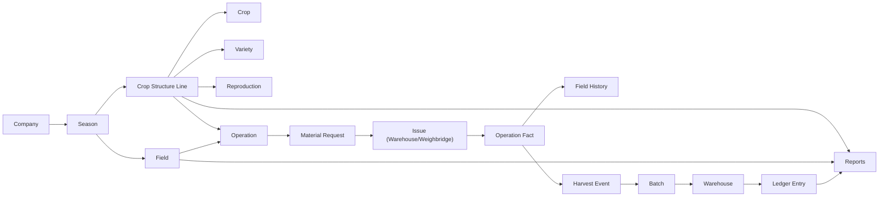
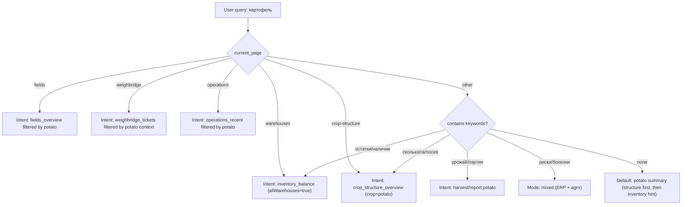

# Travkin Copilot Semantic Knowledge Base

Версия: `v1.0-draft`  
Дата: `2026-05-29`  
Статус: `Knowledge map only (no runtime changes)`

## 0. Scope
Этот документ фиксирует внутреннюю карту знаний Copilot для TravkinFlow как operational agro ERP.  
Документ не внедряет изменения в код, не меняет маршрутизацию, не создает миграций, не трогает данные.

## 1. System Knowledge Graph


## 1.1 Entity Semantics
| Entity | Что это | Зачем | Ключевые связи | Топ-вопросы пользователей |
|---|---|---|---|---|
| Company | Хозяйство (tenant) | Изоляция данных и ролей | Season, Users, Warehouses, Fields | Какая компания сейчас выбрана? |
| Season | Сезон производства | Контекст план/факт | Fields, Crop Structure, Operations, Reports | По какому сезону считаем? |
| Field | Поле (операционная единица) | Центр агро-истории | Crop Structure, Operations, Field History | Что по полю 28? |
| Crop Structure Line | Строка структуры посевов | План культуры/сорта/репродукции | Field, Crop, Variety, Reproduction, Operation | Сколько га картофеля/Галы? |
| Crop | Культура | Классификация агро-потока | Structure, Operations, Materials, Harvest | Что по зерновым/овощным? |
| Variety | Сорт | Детализация для урожая и семян | Structure, Operation lines, Materials, Batches | Где Гала/Сорая? |
| Reproduction | Репродукция семян | Качество/класс посадматериала | Structure, Materials, Batches | Сколько элиты/1 репродукции? |
| Operation | План/задача работ | Управление исполнением | Field, Structure, Material Request, Fact | Какие операции активны? |
| Material Request | Заявка на материалы | Разделение план/подготовка/выдача | Operation, Warehouse issue flow | Что ждет материалы? |
| Issue | Факт выдачи со склада/весовой | Юридически и операционно фиксирует движение | Warehouse, Ledger, Field context | Сколько выдали на поле? |
| Operation Fact | Факт выполнения работ | Источник факта по полю | Operation, Field History, KPI | Что реально выполнено? |
| Field History | Хронология факта по полю | Аналитика и traceability | Operation Fact, Issue, Harvest | Что делали на поле и когда? |
| Harvest Event | Событие уборки | Переход полевого факта в складской контур | Weighbridge, Batch, Warehouse | Сколько собрали сегодня? |
| Warehouse | Место хранения | Остатки и движение | Batches, Ledger, Issue/Receipt | Что в наличии по складам? |
| Batch | Партия продукта | Identity и происхождение | Warehouse, Ledger, Harvest | Где лежит партия урожая? |
| Ledger Entry | Неизменяемая проводка движения | Source of truth по остаткам | Warehouse, Batch, Issue/Receipt | Почему изменился остаток? |
| Reports | Сводная аналитика | Управленческие решения | Structure, Ledger, Operations, Harvest | Отчет по картофелю/складам? |

## 1.2 Core Operational Principles
1. Operation != Issue  
2. Issue != Consumption  
3. READY не уменьшает остатки  
4. ISSUED уменьшает остатки  
5. Field card показывает только факт  
6. Ledger immutable (archive/storno вместо hard rewrite)  
7. Batch identity нельзя терять  
8. Company scope обязателен во всех запросах

## 2. Domain Dictionary

## 2.1 Agronomy Terms
| Термин | Значение |
|---|---|
| Междурядье | Расстояние между рядами, м |
| Межсеменное расстояние | Расстояние между семенами в ряду, см |
| Рядки | Количество рядов/рядков на площади |
| Норма внесения | Количество материала на га |
| Плановая площадь | Запланированные гектары |
| Фактическая площадь | Реально выполненные гектары |
| Ротация | Севооборот по годам |
| СЗР | Средства защиты растений |
| Фитофтора | Болезнь картофеля (late blight) |
| Репродукция | Класс семенного материала |

## 2.2 Farm Slang & Alias Dictionary
| Alias/Сленг | Canonical |
|---|---|
| картошка | картофель |
| химия | СЗР / pesticides |
| солярка | дизель / diesel fuel |
| горючка | ГСМ / fuel |
| аммиачка | селитра / ammonium nitrate |
| диамофос | диаммофоска / DAP |
| диаммофос | диаммофоска / DAP |
| DAP | диаммофоска |
| овощной | овощной склад |
| семенной | склад семян |
| зерновой | зерновой склад |
| Гала | Gala |
| Сорая | Soraya |
| Балтик Роуз | Baltic Rose |
| Азилит | Azilit |
| Коломбо | Colombo |
| Импала | Impala |

## 2.3 Crop Group Dictionary
| Группа | Культуры (базовый набор) |
|---|---|
| зерновые | пшеница, ячмень, овес, кукуруза |
| масличные | лен, рапс, подсолнечник, соя |
| овощные | картофель, морковь, лук |
| кормовые | люцерна, многолетние травы, силосные |
| бобовые | горох, нут, чечевица, соя |
| технические | сахарная свекла, лен, табак, хлопок |
| row crops | картофель, морковь, лук, кукуруза |

## 2.4 Warehouse & Weighbridge Terms
| Термин | Значение |
|---|---|
| Приход | Входящее движение в склад |
| Расход | Исходящее движение со склада |
| Перемещение | Склад -> склад |
| Талон | Документ взвешивания/движения |
| Брутто | Вес с грузом |
| Тара | Вес пустой машины |
| Нетто | Брутто - Тара |
| Active ticket | Талон в работе |
| Finalized | Талон закрыт и отражен |
| Voided/Storno | Аннулирование с сохранением истории |

## 2.5 Cadastre/Legal Terms
| Термин | Значение |
|---|---|
| Кадастр | Юридический земельный идентификатор |
| Юр покрытие | Доля агро-площади, обеспеченная юридическими связями |
| Gap | Агро-поле без юридической привязки |
| Owner overlay | Доп. слой владельца без удвоения площадей |

## 3. Question Library (360 real user prompts)
Формат: `Qxxx` + естественный запрос пользователя.

## 3.1 Поля (Q001-Q030)
Q001. Что по полю 28?  
Q002. Какая площадь у поля 28?  
Q003. Какие культуры на поле 28 в сезоне 2026?  
Q004. Какие операции были на поле 28?  
Q005. Что внесли на поле 28?  
Q006. Покажи историю поля 28.  
Q007. Есть ли активные операции на поле 28?  
Q008. Какие сорта на поле 28?  
Q009. Какая репродукция используется на поле 28?  
Q010. По какому полю больше всего работ в этом сезоне?  
Q011. Какие поля без операций в этом месяце?  
Q012. Какие поля без материалов?  
Q013. Какие поля без урожая?  
Q014. Сколько всего полей у нас?  
Q015. Какие поля самые большие?  
Q016. Какие поля меньше 10 га?  
Q017. Какие поля под картофелем?  
Q018. Какие поля под зерновыми?  
Q019. Какие поля под масличными?  
Q020. Какие поля без структуры посевов?  
Q021. Какие поля без юр покрытия?  
Q022. Какие поля с расхождением план/факт?  
Q023. Покажи поле 1.  
Q024. Покажи поле 4 Сад.  
Q025. Покажи поле 49 Плотина.  
Q026. Какая последняя операция по полю 9?  
Q027. Сколько материалов ушло на поле 9?  
Q028. Сколько собрали с поля 49 Плотина?  
Q029. Какие риски по полю 28?  
Q030. Открой карточку поля 28.

## 3.2 Структура посевов / сезон (Q031-Q060)
Q031. Сколько посевных площадей у нас?  
Q032. Общая площадь полей по сезону 2026?  
Q033. Сколько га засеяно в 2026?  
Q034. Сколько га не распределено?  
Q035. Сколько культур в структуре 2026?  
Q036. Какие культуры в структуре 2026?  
Q037. Сколько по зерновым?  
Q038. Сколько по масличным?  
Q039. Сколько по овощным?  
Q040. Сколько по бобовым?  
Q041. Какая площадь под картофелем?  
Q042. Какая площадь под пшеницей?  
Q043. Какая площадь под ячменем?  
Q044. Какая площадь под рапсом?  
Q045. Какие поля в структуре без сорта?  
Q046. Какие строки без репродукции?  
Q047. Где есть split fields?  
Q048. Есть ли over-allocation по полям?  
Q049. Какие поля перенесены с прошлого сезона?  
Q050. Что изменилось в структуре к прошлому году?  
Q051. Сколько строк структуры всего?  
Q052. Какие поля не закрыты по плану?  
Q053. Покажи топ-5 культур по площади.  
Q054. Где Гала в структуре?  
Q055. Где Сорая в структуре?  
Q056. Где Балтик Роуз в структуре?  
Q057. Где Азилит в структуре?  
Q058. Сколько элиты в структуре?  
Q059. Сколько 1 репродукции в структуре?  
Q060. Открой структуру посевов.

## 3.3 Картофельный домен (Q061-Q090)
Q061. Что по картофелю?  
Q062. Сколько посажено картофеля?  
Q063. Сколько га картофеля в 2026?  
Q064. Какие сорта картофеля в этом сезоне?  
Q065. Сколько Галы?  
Q066. Сколько Сораи?  
Q067. Где Гала посажена?  
Q068. Где Сорая посажена?  
Q069. Где Балтик Роуз посажена?  
Q070. Сколько элиты по картофелю?  
Q071. Сколько 1 репродукции по картофелю?  
Q072. Сколько семян ушло на картофель?  
Q073. Сколько диаммофоски ушло на картофель?  
Q074. Какая фактическая норма семян по картофелю?  
Q075. Где перерасход семян по картофелю?  
Q076. Где недовнесение удобрения по картофелю?  
Q077. Какие операции картофеля активны?  
Q078. Какие поля картофеля без завершенного факта?  
Q079. Сколько картофеля на хранении?  
Q080. В каком складе больше картофеля?  
Q081. Какие партии картофеля есть?  
Q082. Какие партии картофеля уже отгружали?  
Q083. Какой урожай картофеля по полю 28?  
Q084. Какая урожайность картофеля по полю 28?  
Q085. Что по рискам фитофторы по картофелю?  
Q086. Есть ли разрыв между issue и fact по картофелю?  
Q087. Что по Гале и рискам?  
Q088. Что по Сорае и рискам?  
Q089. Дай итог по картофелю в 3 строках.  
Q090. Открой отчет по картофелю.

## 3.4 Склады и остатки (Q091-Q120)
Q091. Какие остатки по всем складам?  
Q092. Сколько картофеля на складах?  
Q093. На складах есть картофель?  
Q094. Где лежит картофель?  
Q095. Сколько семян Гала в наличии?  
Q096. Сколько семян Сорая в наличии?  
Q097. Остатки по овощному складу.  
Q098. Остатки по семенному складу.  
Q099. Остатки по складу удобрений.  
Q100. Остатки по складу СЗР.  
Q101. Что в минусе по складам?  
Q102. Покажи отрицательные остатки.  
Q103. Какие низкие остатки по удобрениям?  
Q104. Какие низкие остатки по СЗР?  
Q105. Последние движения складов.  
Q106. Что пришло сегодня на склад?  
Q107. Что ушло сегодня со складов?  
Q108. Какие перемещения между складами были сегодня?  
Q109. По какой партии самый большой остаток?  
Q110. Где хранится партия X?  
Q111. Есть ли дубли партии по складам?  
Q112. Почему остаток по складу изменился?  
Q113. Покажи ledger по складу семян.  
Q114. Какие склады архивные?  
Q115. Какие склады активные?  
Q116. Есть ли склады без истории движений?  
Q117. Какие продукты чаще всего расходуются?  
Q118. Какой склад самый загруженный по объему?  
Q119. Остатки в кг и тоннах по картофелю.  
Q120. Открой страницу складов.

## 3.5 Весовая и талоны (Q121-Q150)
Q121. Активные талоны сейчас?  
Q122. Последние талоны за день.  
Q123. Сколько талонов открыто?  
Q124. Какие талоны ждут второе взвешивание?  
Q125. Какие талоны готовы к закрытию?  
Q126. Сколько финализировано сегодня?  
Q127. Какие талоны voided сегодня?  
Q128. Талоны по полю 28.  
Q129. Талоны по складу овощной.  
Q130. Талоны по операции issue_to_field.  
Q131. Талоны по harvest_incoming.  
Q132. Сколько рейсов сегодня?  
Q133. Сколько тонн прошло через весовую сегодня?  
Q134. Какие машины в открытых талонах?  
Q135. Какие водители в открытых талонах?  
Q136. Где есть риск двойного закрытия талона?  
Q137. Есть ли повторные ticket_no?  
Q138. Какие талоны без нетто?  
Q139. Есть ли талоны с тарой больше брутто?  
Q140. Какие талоны созданы вручную?  
Q141. Какие талоны с ручной правкой веса?  
Q142. Последние 30 талонов по компании.  
Q143. Покажи талон WB-...  
Q144. Кто закрыл больше талонов сегодня?  
Q145. Какие талоны создали ledger движения?  
Q146. Какие талоны без ledger?  
Q147. Есть ли race condition по закрытию талонов?  
Q148. Открой рабочую весовую.  
Q149. Открой историю талонов.  
Q150. Открой активные талоны.

## 3.6 Операции (Q151-Q180)
Q151. Какие активные операции?  
Q152. Какие операции in_progress?  
Q153. Какие операции waiting_materials?  
Q154. Какие операции ready_to_start?  
Q155. Какие операции overdue?  
Q156. Какие операции завершены сегодня?  
Q157. Какие операции по картофелю?  
Q158. Какие операции по полю 28?  
Q159. Какие операции без material request?  
Q160. Какие операции без факта?  
Q161. Какие операции частично выполнены?  
Q162. Где biggest gap между planned и actual area?  
Q163. Какие операции по СЗР?  
Q164. Какие операции по удобрениям?  
Q165. Какие операции по уборке?  
Q166. Какие специалисты назначены на операции?  
Q167. Какие операции у Иванова?  
Q168. Какие операции без назначенного специалиста?  
Q169. Какие операции требуют подтверждения?  
Q170. Почему операция X не стартует?  
Q171. Почему операция X не закрыта?  
Q172. Где блок по материалам?  
Q173. Какие операции завершены без issue?  
Q174. Какие операции имеют issue, но нет fact?  
Q175. Какие операции имеют fact без issue?  
Q176. Сколько обработали гектаров по операциям?  
Q177. Топ операций по площади за месяц.  
Q178. Какие operation lines созданы по картофелю?  
Q179. Открой список операций.  
Q180. Открой детали операции X.

## 3.7 Материалы, удобрения, СЗР (Q181-Q210)
Q181. Сколько семян ушло в сезоне 2026?  
Q182. Сколько удобрений внесли в 2026?  
Q183. Сколько СЗР использовали в 2026?  
Q184. Сколько диаммофоски внесли?  
Q185. Сколько селитры внесли?  
Q186. Какие фунгициды применяли?  
Q187. Какие гербициды применяли?  
Q188. Какие инсектициды применяли?  
Q189. Где перерасход удобрений?  
Q190. Где перерасход СЗР?  
Q191. Где недовнесение СЗР?  
Q192. Факт кг/га по семенам на картофель.  
Q193. Факт кг/га по диаммофоске на картофель.  
Q194. Сколько выдали, сколько вернули по материалам?  
Q195. Какие материалы в статусе ready?  
Q196. Какие материалы в статусе issued?  
Q197. Какие materials requests partially_issued?  
Q198. Какие материалы без batch linkage?  
Q199. Какие issue без operation_line_id?  
Q200. Сколько расхода по сорту Гала?  
Q201. Сколько расхода по сорту Сорая?  
Q202. Сколько расхода по репродукции Элита?  
Q203. Сколько расхода по репродукции 1 репродукция?  
Q204. Какие материалы по полю 9?  
Q205. Какие материалы по полю 49 Плотина?  
Q206. Какие материалы в отрицательном остатке?  
Q207. Какие материалы low stock?  
Q208. Какие материалы идут на ближайшие операции?  
Q209. Что по нормам и факту по СЗР?  
Q210. Дай summary по материалам за неделю.

## 3.8 Урожай, партии, хранение (Q211-Q240)
Q211. Сколько убрали в этом сезоне?  
Q212. Сколько поступило урожая сегодня?  
Q213. Какой урожай по полю 28?  
Q214. Урожайность по полю 28?  
Q215. Какие партии урожая созданы сегодня?  
Q216. Где хранится урожай картофеля?  
Q217. Какие партии уже отгрузили?  
Q218. Какие партии в овощном складе?  
Q219. Какие партии в временном складе?  
Q220. Какие партии без связи с полем?  
Q221. Какие партии без связи с operation?  
Q222. Какие партии без batch_class?  
Q223. Какие партии с максимальным объемом?  
Q224. Какой средний размер партии картофеля?  
Q225. Какие harvest tickets не создали партию?  
Q226. Есть ли дублирование партии по identity?  
Q227. Какие партии участвовали в перемещении сегодня?  
Q228. Какие партии ушли в переработку?  
Q229. Какие партии со статусом rejected?  
Q230. Какие партии с высоким риском traceability gap?  
Q231. Сколько картофеля на хранении суммарно?  
Q232. Сколько картофеля на хранении по сортам?  
Q233. Сколько картофеля на хранении по репродукциям?  
Q234. Сколько урожая пришло с поля 49 Плотина?  
Q235. Сколько урожая пришло с поля 4 Сад?  
Q236. Где biggest harvest gap plan vs fact?  
Q237. Какие поля еще не дали урожай?  
Q238. Открой harvest аналитику.  
Q239. Открой traceability партии X.  
Q240. Дай краткий harvest summary.

## 3.9 Техника, машины, водители (Q241-Q270)
Q241. Сколько рейсов сегодня у водителя Иванов?  
Q242. Сколько тонн привезла машина A123BC?  
Q243. Какие машины в активных талонах?  
Q244. Какие водители сейчас в работе?  
Q245. Какие машины не закрыли талоны?  
Q246. Кто сделал больше рейсов сегодня?  
Q247. Рейтинг водителей за неделю.  
Q248. Рейтинг машин по тоннажу за неделю.  
Q249. Какие машины без привязки к водителю?  
Q250. Какие водители без рейсов сегодня?  
Q251. Какие машины работали по полю 28?  
Q252. Какие водители работали по полю 28?  
Q253. Какие машины чаще в issue_to_field?  
Q254. Какие машины чаще в harvest_incoming?  
Q255. Есть ли аномальные рейсы по весу?  
Q256. Есть ли дубли рейсов?  
Q257. Какие машины с ручной тарой?  
Q258. Какие водители с частыми voided талонами?  
Q259. Какая средняя загрузка машины по рейсам?  
Q260. Кто работал в ночную смену?  
Q261. Какие машины работали после закрытия смены?  
Q262. Какие водители с максимальным нетто?  
Q263. Какие машины по картофелю сегодня?  
Q264. Кто возил семена Гала?  
Q265. Какие рейсы связаны с операцией X?  
Q266. Какие машины в очереди весовой?  
Q267. Где сейчас машина A123BC?  
Q268. Открой страницу машин.  
Q269. Открой весовую и покажи активные рейсы.  
Q270. Дай summary по водителям за день.

## 3.10 Кадастр и право (Q271-Q300)
Q271. Какие поля без кадастра?  
Q272. Какие поля без юр покрытия?  
Q273. Сколько га без юр покрытия?  
Q274. Какое юридическое покрытие по компании?  
Q275. Какие расхождения агро vs юр?  
Q276. Кто собственник по полю 28?  
Q277. Какие собственники по полю 49 Плотина?  
Q278. Площади по собственникам.  
Q279. Какие договоры аренды скоро заканчиваются?  
Q280. Где нет договора аренды?  
Q281. Какие кадастры связаны с полем 28?  
Q282. Какие поля связаны с кадастром X?  
Q283. Есть ли дубли cadastral links?  
Q284. Есть ли owner overlay без legal link?  
Q285. Какие gap rows по legal layer?  
Q286. Сколько уникальной кадастровой площади?  
Q287. Сколько пашни по юр-слою?  
Q288. Где broken legal rows?  
Q289. Где XML мусор в legal импорте?  
Q290. Какие записи требуют manual review?  
Q291. Что по vine/circle mapping?  
Q292. Где partial legal coverage?  
Q293. Где full legal coverage?  
Q294. Сколько owner entities в системе?  
Q295. Какие поля без owner?  
Q296. Какие поля без rural district?  
Q297. Дай legal top cards summary.  
Q298. Открой кадастр и право.  
Q299. Экспорт отчета по кадастру.  
Q300. Что изменилось в legal покрытии за месяц?

## 3.11 Отчеты и аналитика (Q301-Q330)
Q301. Дай отчет по картофелю.  
Q302. Дай отчет по складам.  
Q303. Дай отчет по полям.  
Q304. Дай отчет по операциям.  
Q305. Дай отчет по талонам.  
Q306. Дай отчет по ГСМ.  
Q307. Дай отчет по материалам.  
Q308. Дай отчет по урожаю.  
Q309. Сводка дня по хозяйству.  
Q310. Сводка недели по хозяйству.  
Q311. Сводка месяца по хозяйству.  
Q312. Где biggest отклонение план/факт?  
Q313. Где biggest перерасход материалов?  
Q314. Где biggest задержки по операциям?  
Q315. Какие поля в зоне риска по выполнению?  
Q316. Какие склады в зоне риска по остаткам?  
Q317. Какие талоны в зоне риска по закрытию?  
Q318. Какие операции в зоне риска по материалам?  
Q319. Какие культуры недосеяны?  
Q320. Какие культуры перегружены по площади?  
Q321. KPI по картофелю в 3 строках.  
Q322. KPI по зерновым в 3 строках.  
Q323. KPI по весовой за сегодня.  
Q324. KPI по складам за сегодня.  
Q325. KPI по operations за сегодня.  
Q326. Что критично проверить прямо сейчас?  
Q327. Экспорт в Excel по картофелю.  
Q328. Экспорт в Excel по складам.  
Q329. Открой аналитику.  
Q330. Дай executive summary по хозяйству.

## 3.12 Агрономия и mixed-запросы (Q331-Q360)
Q331. Что такое фитофтора?  
Q332. Как распознать фитофтору на картофеле?  
Q333. Какие риски фитофторы сейчас по нашим полям?  
Q334. Что такое междурядка?  
Q335. Что такое межсеменное расстояние?  
Q336. Как считать растений на гектар?  
Q337. Какая базовая норма посадки картофеля?  
Q338. Как понять перерасход семян?  
Q339. Чем отличается issue от fact?  
Q340. Почему READY не списывает склад?  
Q341. Когда склад должен списаться?  
Q342. Почему операция не может стартовать?  
Q343. Что проверить, если нет данных в отчете?  
Q344. Что проверить, если отрицательные остатки?  
Q345. Что проверить, если нетто неверное?  
Q346. Что по картофелю и рискам фитофторы?  
Q347. Что по зерновым и рискам урожайности?  
Q348. Что по масличным и рискам питания?  
Q349. Где у нас потенциальные bottlenecks по складам?  
Q350. Где bottlenecks по весовой?  
Q351. Где bottlenecks по операциям?  
Q352. Что важнее закрыть сегодня в производстве?  
Q353. Как быстро проверить готовность к уборке?  
Q354. Как проверить целостность картофельного цикла?  
Q355. Как проверить traceability партии?  
Q356. Какие действия снизят риск потерь сегодня?  
Q357. Открой поле 28 и дай risk-note.  
Q358. Открой склады и дай risk-note.  
Q359. Открой весовую и дай risk-note.  
Q360. Дай план действий на смену в 5 шагах.

## 4. Answer Templates by Category
Принцип формата: `Key number first -> short breakdown -> warning/next action`.

## 4.1 Fields Summary Template
```
Поле {field_name}: {area_ha} га, культура {crop_main}.
Операции: активных {ops_active}, завершено {ops_done}.
Материалы: семена {seed_qty}, удобрения {fert_qty}, СЗР {pest_qty}.
Урожай: {harvest_qty} (если есть).
Риск: {risk_note}.
Действия: [Открыть поле] [История поля] [Материалы]
```

## 4.2 Crop Structure Summary Template
```
Всего посевных площадей: {total_area_ha} га.
Культур: {crops_count}. Топ: {top_crops}.
Сезон: {season}.
Действия: [Открыть структуру посевов]
```

## 4.3 Potato Summary Template
```
По картофелю в сезоне {season}: {potato_area_ha} га.
Поля: {fields_count}. Сорта: {varieties_summary}.
Материалы: семена {seed_total}, диаммофоска {dap_total}.
Действия: [Отчет по картофелю] [Поля картофеля]
```

## 4.4 Warehouse Balance Template
```
По складам найдено: {total_qty}.
Основной объем: {top_warehouse}.
Разбивка: {top_items_short}.
Предупреждение: {negative_or_low_stock_note}.
Действия: [Открыть склады] [Отрицательные остатки]
```

## 4.5 Weighbridge Template
```
Талоны: активных {active_count}, закрыто сегодня {finalized_today}.
Ожидают закрытия: {ready_to_close}.
Последние: {recent_short}.
Действия: [Открыть весовую] [История талонов]
```

## 4.6 Operations Template
```
Операции: активных {active}, в работе {in_progress}, ожидают материалы {waiting_materials}.
По картофелю: {potato_ops_count}.
Критично: {overdue_or_blocked}.
Действия: [Открыть операции] [Показать блоки]
```

## 4.7 Materials Usage Template
```
Расход {material_scope}: {total_qty}.
Факт/га: {actual_rate}. План/га: {planned_rate}.
Отклонение: {delta}.
Действия: [Отчет по материалам] [Поля с отклонением]
```

## 4.8 Fuel Balance Template
```
В наличии ГСМ: {fuel_total_l} л.
Источники: {sources_short}.
Предупреждение: {negative_or_low_fuel}.
Действия: [Открыть ГСМ] [Движения ГСМ]
```

## 4.9 Legal Coverage Template
```
Юридическое покрытие: {coverage_pct}%.
Без юр покрытия: {gap_area_ha} га.
Поля с gap: {gap_fields_short}.
Действия: [Открыть кадастр и право] [Отчет по gaps]
```

## 4.10 Agro Knowledge Template
```
Коротко: {term_definition}.
Практически: {what_to_check_now}.
Риски: {risk_signs}.
Следующий шаг: {next_step}.
```

## 5. Default Decision Tree

## 5.1 Ambiguous Query Tree (“картофель”)


## 5.2 Clarification Rules
Уточнение нужно только если:
1. Найдено несколько одинаковых полей/складов и нельзя безопасно выбрать одно.  
2. Запрос про действие может привести к неверному результату без объекта.  
3. Контекст пустой и запрос реально неоднозначен для safe default.

Уточнение не нужно:
1. “Сколько посевных площадей?”  
2. “Остатки картофеля”  
3. “Что по зерновым?”  
4. “Отрицательные остатки”  
5. “Последние талоны”  
6. “Активные операции”

## 6. ERP -> Tool Map
| Intent Group | Trigger examples | Default rules | Tool chain | Expected result | Answer format |
|---|---|---|---|---|---|
| company_context | из какой я компании | season=2026 fallback | get_company_context, get_current_season | company + season | summary_total |
| fields_overview | сколько земли, поля | season default | get_fields, search_fields | total area, field count | summary_total/list |
| crop_structure_overview | сколько посевных, зерновые | selected season > 2026 > latest | get_crop_structure_summary, search_crops_by_group | area by crop/group | summary_total/filtered_summary |
| potato_domain | картофель, Гала, Сорая | crop_alias resolve | get_crop_structure_summary, get_potato_material_report | potato area/materials summary | filtered_summary |
| inventory_balance | остатки, наличие | allWarehouses=true if warehouse omitted | get_warehouse_stock/get_warehouse_balances | qty by warehouse/product | balance |
| warehouse_movements | движения, приход, расход | last 30 by default | get_warehouse_movements | recent moves | movements |
| negative_stock | отрицательные остатки | all warehouses | get_warehouse_stock (negative_only=true) | anomaly rows | balance + warning |
| weighbridge_tickets | активные талоны, последние талоны | active/open or limit=30 | get_active_tickets/get_recent_tickets/get_ticket_details | ticket statuses | filtered_summary/list |
| operations_recent | активные операции, waiting materials | active/in_progress/open | get_active_operations/search_operations/get_operation_details | operation status summary | list/filtered_summary |
| fuel_balance | сколько бензина есть, остаток ГСМ | all sources | get_fuel_balances | liters in stock | balance |
| fuel_movements | движения бензина, выдача ГСМ | last 30 | get_fuel_movements | issue/refill/transfer history | movements |
| field_details | что по полю 28 | resolve by query/number | find_field, get_field_card, get_field_timeline, get_field_materials | field-centric snapshot | filtered_summary |
| cadastre_legal | без кадастра, собственник | legal scope | cadastre module query/report | legal coverage/gaps | filtered_summary |
| navigation | открой весовую/склады/поля | route map | navigate_to_page, open_entity, apply_filter | route action | action_navigation |
| mixed_risk | что по картофелю и рискам | ERP first then agro reasoning | crop/inventory tools + agro mode | data + risk note | filtered_summary |

## 6.1 Current Tool Namespaces in Runtime
- context: get_current_context, get_company_context, get_current_season  
- navigation: get_routes, navigate_to_page, open_entity, apply_filter  
- fields: search_fields, find_field, get_field_card, get_field_timeline, get_field_materials, get_fields  
- crop: get_crop_structure, get_crop_structure_summary, search_crops_by_group  
- warehouses/inventory: search_warehouses, find_warehouse, get_warehouse_stock, get_warehouse_balances, get_warehouse_summary, get_warehouse_movements, get_inventory, get_batches  
- operations: search_operations, find_operation, get_active_operations, get_operation_details, get_operations  
- weighbridge: get_active_tickets, get_recent_tickets, get_ticket_details, get_weighbridge_tickets  
- fuel: get_fuel_sources, get_fuel_balances, get_fuel_movements  
- reports: get_potato_material_report

## 7. Deliverable Report: Travkin Copilot Semantic Knowledge Base

## 7.1 Что собрано
1. Полный semantic graph сущностей TravkinFlow.  
2. Domain dictionary (агрономия, сленг, группы культур, склад/весовая, legal).  
3. Question library на `360` реальных операционных запросов.  
4. Answer templates для основных интент-групп.  
5. Decision tree по ambiguous-запросам и правилам уточнения.  
6. ERP -> Tool map c expected output format.

## 7.2 Готовность к следующему этапу
Этот документ готов как базовый источник для:
1. Prompt hardening.  
2. Intent router calibration.  
3. Tool orchestration policy.  
4. Regression QA матрицы Copilot.

## 7.3 Ограничение текущего шага
В этом шаге не выполнено внедрение в runtime и не изменены production data flows.
