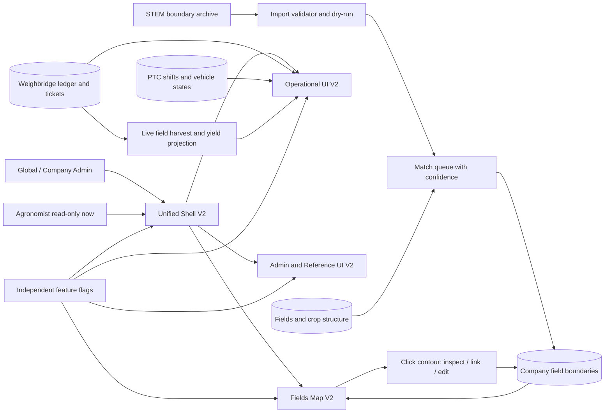

# Большое обновление TravkinFlow 2 — master plan и бортовой журнал

Обновлено: 2026-09-09 (Asia/Qyzylorda)

## Текущая точка восстановления

- Статус программы: `В РАБОТЕ`.
- Общий прогресс: `27% планирования / 0% релизных волн`.
- Worktree: `C:\Users\TRAVKIN\Downloads\CodecSaaS\.worktrees\travkinflow-2`.
- Ветка: `codex/travkinflow-2`.
- База ветки: `3274331e7180252dd0f740222f6c4d15e4d20ebd`.
- На момент старта `origin/master`, GitHub и Product health совпадали на `3274331e7180`.
- Следующий безопасный шаг: завершить read-only карту компонентов и данных, затем начать Wave 1 с общего UI foundation и карты без Product deploy.
- Production rollout: `НЕ НАЧАТ`; каждую волну выкладывать отдельно после Preview/QA и свежей проверки Product.

Если работа прерывается P0-задачей, продолжать с первого незакрытого чекбокса ниже. После каждого существенного рубежа обновлять этот раздел, а под выполненным пунктом писать краткое `Сделано` и доказательство проверки.

## Уже выполнено

- [x] P0: финально аннулирован дублирующий талон `WB-100000-20260908080517-7NJG`.
  - Сделано: вызван канонический атомарный storno-контракт с причиной `Дублирующий талон: повторно внесены идентичные брутто/тара/автомобиль.`
  - Проверено: статус `voided`, одна базовая и одна зеркальная проводка, эффект талона `0 кг`, связанная дублирующая партия `0 кг`.
  - Контроль: 43 действующих талона, `254 260 кг` net и accepted — совпадает с бумажным реестром.
- [x] Прочитан постоянный handoff-протокол и текущий акт; исторические факты отделены от live-проверки.
- [x] Live Git/Product checkpoint и изоляция.
  - Сделано: свежий fetch, GitHub `origin/master` и `/api/healthz` сверены; создан отдельный чистый worktree от точного Product SHA.
  - Проверено: divergence `0/0`, tracked status clean до создания этого плана.
- [x] Проведён внешний обзор паттернов агрокарт и доступного drag-and-drop.
  - Решение: использовать карту как главное рабочее полотно, а не как фон под набором перекрывающихся панелей; действия раскрывать по контексту выбранного поля.

## Цель и продуктовые принципы

1. Сделать TravkinFlow цельным, быстрым и спокойным рабочим инструментом, а не набором отдельных экранов.
2. Убрать «суп из рамок»: максимум одна поверхность/граница на смысловой регион; вложенность показывать пространством, типографикой, цветом и тонкими разделителями.
3. Визуальный язык — сдержанная тёмная аграрная картография: уголь/почва, приглушённый текст, зерновое золото только для действия и фокуса, мох для успеха, ржаво-бордовый для опасности. Никаких гербов, дерева, металла, пергамента или средневекового декора.
4. Анимации объясняют изменение состояния: 120–180 мс для появления/перемещения/settle, без параллакса и пружин; обязательный `prefers-reduced-motion`.
5. Живая весовая и PTC важнее визуального релиза: никакой одной огромной выкладки, никаких слепых миграций и никаких Product writes для QA.
6. Изменения данных — только аддитивные, scoped по компании, идемпотентные и с явным откатом/выключателем.
7. Карта в текущей волне хранит целые контуры полей. Контуры участков внутри поля — отдельная следующая волна, но схема не должна закрывать этот путь.

## Архитектурная схема

## Реестр 32 замечаний

Статусы: `[ ]` не начато, `[-]` в работе, `[x]` выполнено и проверено.

### Карта полей

- [ ] C01. Полностью пересобрать композицию `/fields-map`, чтобы панели не лежали друг на друге.
- [ ] C02. Убрать дублирующее название выбранной компании из header.
- [ ] C03. Привести все плавающие панели карты к одной спокойной matte/glass surface.
- [ ] C04. Привести кнопки измерения к той же панели, убрать белую/случайную подложку.
- [ ] C05. Убрать селектор года из карты; сезон брать из общего контекста.

### Склады

- [ ] C06. Добавить доступную сортировку складов hold/drag/drop с плавным settle и сохранением порядка.
- [ ] C22. Пересобрать визуал карточек складов: единый размер, ясная иерархия, без декоративной «формы склада» ради формы.
- [ ] C29. Исправить семантику счётчика: не заменять смешанную «группу» словом «партия» вслепую; показывать партии и материалы отдельно либо нейтральные позиции.
- [ ] C30. Убрать внешнюю строку `Движение: дата`; история остаётся в detail.
- [ ] C31. Убрать бессодержательные `Свободно` и `Движений пока нет`; пустое состояние показать спокойно и компактно.

### PTC / оборот машин

- [ ] C07. Улучшить desktop board и анимации перехода карточек между колонками для агронома/автопарка/операторов.
- [ ] C08. Сделать свайп комбайнёра намеренным: больший width-aware threshold, horizontal-intent guard, плавный preview/commit/cancel.
- [ ] C09. Убрать ощущение отдельного продукта: единый shell, визуальный язык и понятный auth/session transition без переписывания безопасной ролевой модели.
- [ ] C32. Сделать заголовки статусных колонок sticky в пределах board scroll.

### Весовая

- [ ] C10. Устранить layout shift блока `Партия урожая`: стабильная высота, retained data/cache и предсказуемый loading state при сворачивании/возврате.
- [ ] C11. Закрывать открытый талон оптимистично в UI с idempotency, rollback и явным retry при ошибке.
- [ ] C12. Пересобрать информационную архитектуру всех режимов весовой вокруг одной главной задачи и progressive disclosure.
- [ ] C13. Выполнить полный визуальный redesign режимов без вложенных рамок, сохранив все роли, проводки и контракты.

### Сводка / dashboard / структура посевов

- [ ] C14. Вернуть и хранить историю закрытых PTC-смен, а не только эфемерный `последний` блок.
- [ ] C15. В карточке поля показывать live принятую массу и урожайность из канонических талонов/ledger.
- [ ] C16. Полностью упростить модальное окно поля и редактор структуры, заменив рамки ясными секциями и sticky action bar.
- [ ] C17. Устранить повторную тяжёлую загрузку и появление/исчезновение scrollbar на dashboard.
- [ ] C27. Переименовать `Сводка уборки` в короткое `Сводка`, если страница остаётся общей операционной точкой входа.
- [ ] C28. Убрать разрозненную рамочную композицию dashboard; сформировать одну вертикальную историю состояния хозяйства.

### Platform / справочники / профиль / shell

- [ ] C18. Поднять выбор компаний в начало global platform page.
- [ ] C19. Сделать всю карточку компании настоящей доступной кнопкой; отдельную кнопку `Войти в компанию` убрать, delete изолировать.
- [ ] C20. Добавить subnav и категории в `Машины и техника`, сохранив deep links.
- [ ] C21. Добавить мгновенный умный поиск по названию, бренду, модели, категории, номеру, VIN и водителю с нормализацией RU/латиницы.
- [ ] C23. Добавить безопасную загрузку/замену фото профиля.
- [ ] C24. Показывать фото или initials fallback в header.
- [ ] C25. Проверить опциональный поворот знака логотипа примерно на 40° против часовой стрелки; применять только к mark-варианту, если visual QA не даёт clipping/кринжа.
- [ ] C26. Убрать тяжёлый impersonation banner, но сохранить компактный постоянный индикатор и безопасный возврат в `global_admin`.

## Дополнительный блок M — реальные границы полей STEM

- [ ] M01. Распаковать архив только в локальный временный каталог и инвентаризировать форматы, CRS, число объектов и атрибуты.
- [ ] M02. Провести геометрический preflight: Polygon/MultiPolygon, замыкание колец, self-intersections, пустые геометрии, дубли, bbox хозяйства и расчёт площади.
- [ ] M03. Зафиксировать существующую схему карты и выбрать аддитивный контракт хранения без разрушения текущих полей.
- [ ] M04. Построить deterministic dry-run matching к `fields`/структуре по нормализованному имени, номеру, площади и пространственной близости.
- [ ] M05. Автоматически связать только `high confidence`; ambiguous/no-match оставить в очереди без догадок.
- [ ] M06. Добавить global-admin-only API импорта/перепривязки с company scope, optimistic concurrency и audit trail.
- [ ] M07. На карте: клик по контуру открывает компактный inspector; администратор может связать/отвязать контур с полем структуры.
- [ ] M08. Добавить редактирование полного контура поля с undo/cancel и server validation; agronomist пока только читает.
- [ ] M09. Импортировать подтверждённые контуры через Preview/QA; перед Product write сохранить fingerprint и dry-run отчёт, после — сверить число/площади/связи.
- [ ] M10. Оставить расширяемую связь parent field → future plots, но не рисовать и не мигрировать участки в этой волне.
- [ ] M11. Ортофото/дрон-снимки явно отложены и в этот scope не входят.

## Волны реализации

### Wave 0 — Safety, evidence, design contract

- [x] W0.1. Зафиксировать Product/Git/DB baseline и отдельный worktree.
- [x] W0.2. Зафиксировать этот master plan и реестр замечаний.
- [-] W0.3. Завершить read-only аудит точных компонентов, API, схемы и архива контуров.
- [ ] W0.4. Сохранить initial screenshots/viewport matrix и измерить loading/layout-shift проблемных экранов.
- [ ] W0.5. Зафиксировать независимые default-off flags и release matrix.

Откат: удалить только ветку/worktree; Product не меняется.

### Wave 1 — UI foundation и Fields Map V2

- [ ] W1.1. Добавить scoped surface/motion tokens и глобальную reduced-motion policy без изменения default `Card` всего продукта.
- [ ] W1.2. Пересобрать layout карты: одно рабочее полотно, компактный top dock, контекстный inspector и единый bottom measurement dock.
- [ ] W1.3. Убрать C02/C05 и исправить C01/C03/C04.
- [ ] W1.4. Реализовать M01–M08 и покрыть parser/matcher/API/role tests.
- [ ] W1.5. Провести browser QA карты на 360/768/1304/1440 px, keyboard, touch и reduced motion.

Флаги: `NEXT_PUBLIC_UI_SHELL_V2`, `NEXT_PUBLIC_FIELDS_MAP_V2`, server `FIELD_BOUNDARY_WRITE_V1`.

Откат: UI flags off; write endpoint off; nullable/adдитивные поля и импортные строки остаются inert. Перед Product import обязателен отдельный export/fingerprint.

### Wave 2 — Operational reliability before visual polish

- [ ] W2.1. C10: retained lot options + stable loading geometry.
- [ ] W2.2. C11: optimistic close state machine + rollback/retry/idempotency.
- [ ] W2.3. C14/C17: durable PTC shift history и retained/single-flight dashboard reads.
- [ ] W2.4. C08/C32: intentional swipe and sticky board headers.
- [ ] W2.5. Проверить сценарии active weighbridge/PTC без тестовых Product movements.

Флаги: `NEXT_PUBLIC_WEIGHBRIDGE_UX_V2`, `NEXT_PUBLIC_DASHBOARD_DATA_V2`, `NEXT_PUBLIC_PTC_BOARD_V2`.

Откат: flags off + предыдущий immutable deployment; schema changes только additive и игнорируются старым кодом.

### Wave 3 — Operational visual redesign and field truth

- [ ] W3.1. C12/C13: visual/information redesign всех режимов весовой поверх уже проверенных контрактов.
- [ ] W3.2. C07/C09: unified PTC shell and state motion.
- [ ] W3.3. C15: каноническая projection принятой массы и урожайности в поле.
- [ ] W3.4. C16: новый field/crop-structure editor.
- [ ] W3.5. C27/C28: единая композиция `Сводки`.

Откат: независимые UI flags; никаких откатов бухгалтерских данных.

### Wave 4 — Warehouses, platform, references, profile

- [ ] W4.1. C22/C29/C30/C31: flatten warehouse cards and truthful copy.
- [ ] W4.2. C06: additive `display_order` + атомарный reorder API + accessible DnD.
- [ ] W4.3. C18/C19: accessible clickable company list first.
- [ ] W4.4. C20/C21: machinery subnav and normalized smart search.
- [ ] W4.5. C23/C24: private profile media contract, upload/replace/delete and header avatar.
- [ ] W4.6. C25/C26: opt-in logo angle after visual QA и compact impersonation control с явной ролью/возвратом.

Флаги: `NEXT_PUBLIC_UI_WAREHOUSE_V2`, `WAREHOUSE_ORDER_WRITE_V1`, `NEXT_PUBLIC_UI_PLATFORM_V2`, `NEXT_PUBLIC_UI_REFERENCES_V2`, `NEXT_PUBLIC_PROFILE_AVATAR_V1`, `PROFILE_AVATAR_WRITE_V1`, `NEXT_PUBLIC_UI_SHELL_V2`.

Откат: отключение конкретного surface flag; write endpoints off; nullable DB fields/private bucket не удалять аварийно.

### Wave 5 — Full-story QA and rollout

- [ ] W5.1. TypeScript, scoped ESLint, unit/contract suites и production build.
- [ ] W5.2. Role matrix: global_admin, company_admin, agronomist, fleet manager, weighman, warehouse operator, harvester.
- [ ] W5.3. Browser matrix: desktop/tablet/mobile, touch/keyboard, slow network, reload/back/forward, two tabs, reduced motion.
- [ ] W5.4. Data fingerprints: tickets/ledger/batches/warehouses/field boundaries before and after соответствующих волн.
- [ ] W5.5. Preview deployment на точный SHA; permanent QA only after slot/env confirmation.
- [ ] W5.6. Release one wave at a time: fresh fast-forward proof → immutable Production build → alias → health/log/browser smoke.
- [ ] W5.7. Обновить этот журнал, CURRENT_HANDOFF и отправить один terminal signal только при настоящей финальной границе.

## Предварительная разбивка на коммиты

1. `docs(travkinflow-2): add master delivery plan`
2. `feat(ui): add scoped agrarian surfaces and reduced-motion policy`
3. `refactor(fields-map): introduce uncluttered workspace layout`
4. `feat(fields-map): add validated boundary import and match queue`
5. `feat(fields-map): add admin contour inspector and linking`
6. `fix(weighbridge): retain lot data and eliminate form layout shift`
7. `fix(weighbridge): add optimistic close rollback state machine`
8. `fix(dashboard): retain summaries and persist closed shift history`
9. `feat(ptc): refine swipe, sticky lanes and state motion`
10. `refactor(operations-ui): unify weighbridge, PTC and summary surfaces`
11. `feat(fields): add canonical live harvest and yield projection`
12. `refactor(crop-structure): simplify field structure editor`
13. `refactor(warehouses): flatten cards and correct stock copy`
14. `feat(warehouses): add atomic accessible ordering`
15. `refactor(platform): promote accessible clickable company list`
16. `feat(references): add machinery navigation and smart search`
17. `feat(profile-media): add private avatar storage and guarded API`
18. `feat(profile): add avatar UI and opt-in logo mark angle`
19. `refactor(auth-ui): add compact safe impersonation control`
20. `test(travkinflow-2): add visual, role and full-story gates`

Коммиты можно объединять только если они остаются независимо проверяемыми и откатываемыми. Стадирование всегда выборочное; `git add .` запрещён.

## Acceptance criteria

- Все 32 комментария имеют `[x]`, короткое `Сделано` и конкретное доказательство.
- Карта на 1304×930 не имеет перекрытий; поиск, фильтры, inspector и measurement dock не заслоняют друг друга.
- Все валидные контуры STEM импортированы; каждый auto-link объясним; ambiguous contours остаются явно unmapped.
- Global/company admin может кликнуть контур и безопасно связать/отвязать поле; agronomist не может писать.
- Свайп не срабатывает от тапа, вертикального scroll, короткого или диагонального движения; успешный жест даёт один запрос.
- Закрытие талона ощущается мгновенным, но ошибка полностью восстанавливает карточку и объясняет retry.
- Dashboard и lot selector не прыгают при loading/re-entry; нет лишнего scrollbar flash.
- История закрытых PTC-смен сохраняется и доступна после новых смен/перезагрузки.
- Складской порядок работает мышью, touch и клавиатурой, сохраняется после reload и не меняет stock.
- Поиск техники на 727+ строках остаётся отзывчивым, поддерживает кириллицу/латиницу/номер и deep links.
- Avatar private, валидируется по содержимому, не пишет в чужой профиль при impersonation.
- Все экраны сохраняют явную роль/контекст; возврат из impersonation всегда доступен и fail-visible.
- Нет новых 4xx/5xx/console errors, критичных CLS/LCP регрессий или нарушения `prefers-reduced-motion`.
- Каждая Product-волна имеет точный SHA/deployment, health, browser evidence, data fingerprint и проверенный rollback.

## Открытые решения, которые можно принять без остановки владельца

- `Группы остатков`: по аудиту это смесь harvest lots и material identity groups. По умолчанию показывать раздельно `N партий · M материалов`; если данных для разделения нет — `N позиций`.
- Поворот логотипа: сделать opt-in prototype; оставить только если sidebar/header/mobile/login visual QA проходит без clipping и выглядит взросло.
- Автоматическая привязка контуров: порог high-confidence задаётся после статистики архива; ниже порога никогда не угадывать.
- Порядок релиза: сначала визуальные read-only изменения, затем query/state stability, затем отдельные write-capabilities.

## Журнал рубежей

- 2026-09-09 — P0 duplicate storno завершён; 43 / 254 260 кг подтверждены.
- 2026-09-09 — Product/Git baseline `3274331e7180`; создан `codex/travkinflow-2`.
- 2026-09-09 — master plan создан; реализация ещё не начиналась.
