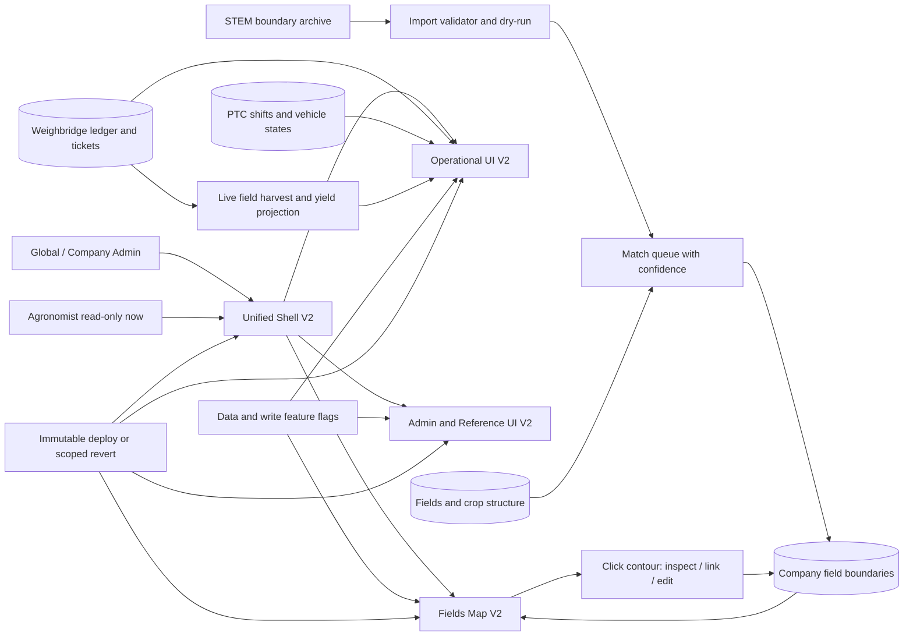

# Большое обновление TravkinFlow 2 — master plan и бортовой журнал

Обновлено: 2026-09-09 (Asia/Qyzylorda)

## Текущая точка восстановления

- Статус программы: `C01-C33 ЛОКАЛЬНО ЗАВЕРШЕНЫ / НОВЫЙ QA CANDIDATE ГОТОВИТСЯ / PRODUCT РЕЛИЗ TF2 НЕ НАЧАТ / POST-UPDATE AUDIT ЗАПЛАНИРОВАН`.
- Общий прогресс: `C01-C33 выполнены / QA baseline развёрнут с flags=0 / C33 Preview pending / 0% Product-релизных волн / 0% финального аудита`.
- Worktree: `C:\Users\TRAVKIN\Downloads\CodecSaaS\.worktrees\travkinflow-2`.
- Ветка: `codex/travkinflow-2`.
- База ветки на старте программы: `3274331e7180252dd0f740222f6c4d15e4d20ebd`.
- На момент старта `origin/master`, GitHub и Product health совпадали на `3274331e7180`. Во время C33 отдельный срочный P0 hotfix весовой был выпущен в Product как `9acb78b52d234cf43714c41b67f03f46b5b98347`; перед новым TF2 Preview этот commit должен быть включён без потери любой из двух реализаций.
- Corrective checkpoint зафиксирован коммитом `72918a8190c37fa1d9fe3437e50f54c6127956d2`; независимые corrective/search-path review дали GO (P0/P1/P2 = 0), все целевые suites, TypeScript, ESLint, diff-check и production build PASS.
- QA branch `gsglkmudcwkdetqtocae` восстановлена точной цепочкой из десяти миграций. PRE был quiescent, POST дал неизменные двенадцать business fingerprints, ноль PTC/ticket/ledger writes, пустые новые PTC/map таблицы и точные ACL/index/function contracts. Permanent `qa.travkinflow.com` указывает на READY Preview `dpl_5S47LAWk79efWj57QTg3VuM2BGUS` точного `72918a`; client/server QA binding и вход Global Admin в пять QA-компаний доказаны. Все одиннадцать rollout-флагов остаются `0`.
- C33 локально закрыт: независимый review P0/P1/P2=`0/0/0`; model 80, repair PGlite 86, manager 63, compact board 757, fast client 282, agronomist read-only 46, browser confirm 398 и fleet mobile 285 PASS, включая Chromium/WebKit, reload/realtime/idempotency и стабильный tie-break.
- Следующий безопасный шаг: зафиксировать C33, включить новый Product P0 commit `9acb78b`, повторить полный local/build gate и развернуть новый immutable QA-кандидат с flags=0. Только после browser smoke продолжать последовательные server-first flag waves и M09. Blind rebase/db push, подмена Product и маскировка отсутствующих prerequisite через `IF EXISTS` запрещены.
- Production rollout: `НЕ НАЧАТ`; каждую волну выкладывать отдельно после Preview/QA и свежей проверки Product.

Если работа прерывается P0-задачей, продолжать с первого незакрытого чекбокса ниже. После каждого существенного рубежа обновлять этот раздел, а под выполненным пунктом писать краткое `Сделано` и доказательство проверки.

## Уже выполнено

- [x] P0: финально аннулирован дублирующий талон `WB-100000-20260908080517-7NJG`.
  - Сделано: вызван канонический атомарный storno-контракт с причиной `Дублирующий талон: повторно внесены идентичные брутто/тара/автомобиль.`
  - Проверено: статус `voided`, одна базовая и одна зеркальная проводка, эффект талона `0 кг`, связанная дублирующая партия `0 кг`.
  - Контроль: 43 действующих талона, `254 260 кг` net и accepted — совпадает с бумажным реестром.
- [x] Прочитан постоянный handoff-протокол и текущий акт; исторические факты отделены от live-проверки.
- [x] Live Git/Product checkpoint и изоляция.
  - Сделано: свежий fetch, GitHub `origin/master` и `/api/healthz` сверены; создан отдельный чистый worktree от точного Product SHA.
  - Проверено: divergence `0/0`, tracked status clean до создания этого плана.
- [x] Проведён внешний обзор паттернов агрокарт и доступного drag-and-drop.
  - Решение: использовать карту как главное рабочее полотно, а не как фон под набором перекрывающихся панелей; действия раскрывать по контексту выбранного поля.

## Цель и продуктовые принципы

1. Сделать TravkinFlow цельным, быстрым и спокойным рабочим инструментом, а не набором отдельных экранов.
2. Убрать «суп из рамок»: максимум одна поверхность/граница на смысловой регион; вложенность показывать пространством, типографикой, цветом и тонкими разделителями.
3. Визуальный язык — сдержанная тёмная аграрная картография: уголь/почва, приглушённый текст, зерновое золото только для действия и фокуса, мох для успеха, ржаво-бордовый для опасности. Никаких гербов, дерева, металла, пергамента или средневекового декора.
4. Анимации объясняют изменение состояния: 120–180 мс для появления/перемещения/settle, без параллакса и пружин; обязательный `prefers-reduced-motion`.
5. Живая весовая и PTC важнее визуального релиза: никакой одной огромной выкладки, никаких слепых миграций и никаких Product writes для QA.
6. Изменения данных — только аддитивные, scoped по компании, идемпотентные и с явным откатом/выключателем.
7. Карта в текущей волне хранит целые контуры полей. Контуры участков внутри поля — отдельная следующая волна, но схема не должна закрывать этот путь.

## Архитектурная схема

## Реестр 33 замечаний

Статусы: `[ ]` не начато, `[-]` в работе, `[x]` выполнено и проверено.

### Карта полей

- [x] C01. Полностью пересобрать композицию `/fields-map`, чтобы панели не лежали друг на друге.
  - Сделано: controls/search собраны в один top dock; inspector стал bottom sheet на компактных экранах и правой панелью на desktop.
  - Проверено: `63b68b2`, `c36f9ff`, map UI contract 11/11 и Chromium/WebKit matrix на 360/768/1304/1440 px без перекрытий и horizontal overflow.
- [x] C02. Убрать дублирующее название выбранной компании из header.
  - Сделано: повторяющаяся подпись компании удалена, company/role context собран в компактный shell (`c43178c`); shell contract 6/6.
- [x] C03. Привести все плавающие панели карты к одной спокойной matte/glass surface.
  - Сделано: добавлены scoped `tf2-dock`/`tf2-panel`, без глобальной замены `Card` (`63b68b2`, `c36f9ff`); map UI 11/11.
- [x] C04. Привести кнопки измерения к той же панели, убрать белую/случайную подложку.
  - Сделано: measurement actions используют тот же matte dock, 44 px touch targets и reduced-motion policy (`63b68b2`, `c36f9ff`); map UI 11/11.
- [x] C05. Убрать селектор года из карты; сезон брать из общего контекста.
  - Сделано: отдельный selector удалён из active render; внутренний сезонный контекст данных сохранён (`63b68b2`); map UI 11/11.

### Склады

- [x] C06. Добавить доступную сортировку складов hold/drag/drop с плавным settle и сохранением порядка.
  - Сделано: добавлены мышь/touch/keyboard reorder, атомарное сохранение порядка и reduced-motion settle (`658a649`); warehouse order contract 32/32.
- [x] C22. Пересобрать визуал карточек складов: единый размер, ясная иерархия, без декоративной «формы склада» ради формы.
  - Сделано: единая flat surface, растянутые grid rows, мягкие hover/focus и reduced motion (`eb6c3a0`); warehouse cards 23/23.
- [x] C29. Исправить семантику счётчика: не заменять смешанную «группу» словом «партия» вслепую; показывать партии и материалы отдельно либо нейтральные позиции.
  - Сделано: достоверный breakdown `партии · позиции материалов`, при неполных данных нейтральные `позиции` (`eb6c3a0`); warehouse cards 23/23.
- [x] C30. Убрать внешнюю строку `Движение: дата`; история остаётся в detail.
  - Сделано: timestamp удалён только с карточки, detail сохраняет последнее движение (`eb6c3a0`); warehouse cards 23/23.
- [x] C31. Убрать бессодержательные `Свободно` и `Движений пока нет`; пустое состояние показать спокойно и компактно.
  - Сделано: пустой склад показывает `0 кг`; материал без массы — `Есть материалы` (`eb6c3a0`); agronomist warehouse contract 36/36.

### PTC / оборот машин

- [x] C07. Улучшить desktop board и анимации перехода карточек между колонками для агронома/автопарка/операторов.
  - Сделано: board получил общую state-motion модель, стабильные карточки и reduced-motion fallback (`b77ae26`); compact board 739/739, operator 131/131.
- [x] C08. Сделать свайп комбайнёра намеренным: больший width-aware threshold, horizontal-intent guard, плавный preview/commit/cancel.
  - Сделано: добавлены width-aware threshold, проверка горизонтального намерения и единственный commit после preview/cancel (`b77ae26`); Chromium/WebKit 322/322 и breakdown 312/312.
- [x] C09. Убрать ощущение отдельного продукта: единый shell, визуальный язык и понятный auth/session transition без переписывания безопасной ролевой модели.
  - Сделано: operator/manager board приведён к общему shell и auth transition без изменения ролевых контрактов (`b77ae26`); operator 131/131 и Chromium/WebKit 322/322.
- [x] C32. Сделать заголовки статусных колонок sticky в пределах board scroll.
  - Сделано: lane headers закреплены внутри собственного board scroll и не перекрывают shell (`b77ae26`); compact board 739/739.
- [x] C33. Исправить время в статусах PTC, возврат из ремонта и сохранение незавершённого этапа.
  - Контракт: вход в ремонт начинает отдельный ремонтный таймер с момента фактической отметки; выход из ремонта начинает новый интервал текущего рабочего статуса. При возврате в `Пустые` машина становится в конец очереди, а не первой.
  - Контракт: ремонт остаётся независимым техническим признаком с собственным таймером. У заведующего любая отмеченная машина сразу находится в `Ремонте`, а машина `С грузом` одновременно остаётся видимой и доступной весовщику, машина `На выгрузке` — приёмке; операторский cargo timer продолжает текущий этап, но новая загрузка ремонтной машины по-прежнему запрещена.
  - Реализация: использовать уже существующие `ptc_vehicle_states.since` и `fleet_vehicle_repairs.changed_at`; новая таблица или разрушительное изменение state machine не требуется. Обязательны model/UI/PGlite/browser regressions, reload/realtime/idempotency и проверка сортировки нескольких машин с одинаковыми временами.
  - Сделано: ремонтный и cargo-интервалы разделены на существующих timestamp; после выхода текущий статус начинается заново, empty-возврат идёт в хвост, loaded/unloading остаются доступны только нужному оператору до завершения. Независимый review P0/P1/P2=`0/0/0`; model 80, repair 86, compact 757, fast-client 282, browser confirm 398 и mobile 285 PASS.

### Весовая

- [x] C10. Устранить layout shift блока `Партия урожая`: стабильная высота, retained data/cache и предсказуемый loading state при сворачивании/возврате.
  - Сделано: options сохраняются между режимами, loading geometry стабилизирована, stale request не сбрасывает выбор (`49fcd7f`); lot contract 19/19.
- [x] C11. Закрывать открытый талон оптимистично в UI с idempotency, rollback и явным retry при ошибке.
  - Сделано: добавлены idempotent reconcile, optimistic state, полный rollback и явный retry (`96a3df7`); close contract 22/22.
- [x] C12. Пересобрать информационную архитектуру всех режимов весовой вокруг одной главной задачи и progressive disclosure.
  - Сделано: семь режимов собраны вокруг основного действия, контекст и вторичные данные раскрываются последовательно (`4135e99`); hierarchy contract 18/18.
- [x] C13. Выполнить полный визуальный redesign режимов без вложенных рамок, сохранив все роли, проводки и контракты.
  - Сделано: поверхности семи режимов выровнены и лишняя рамочная вложенность удалена без изменения ledger/ticket contracts (`34000ab`); visual contract 18/18.

### Сводка / dashboard / структура посевов

- [x] C14. Вернуть и хранить историю закрытых PTC-смен, а не только эфемерный `последний` блок.
  - Сделано: добавлена bounded history закрытых смен и стабильная summary hydration (`ab0bd95`); history 78/78, summary 99/99.
- [x] C15. В карточке поля показывать live принятую массу и урожайность из канонических талонов/ledger.
  - Сделано: масса и урожайность считаются из reconciled канонической проекции, новая data surface fail-closed по флагу (`02d05f4`, `3e15435`); field harvest 13/13.
- [x] C16. Полностью упростить модальное окно поля и редактор структуры, заменив рамки ясными секциями и sticky action bar.
  - Сделано: редактор разделён на читаемые секции со sticky actions и спокойными состояниями (`9602748`); crop dialog 30/30, optional seed 20/20.
- [x] C17. Устранить повторную тяжёлую загрузку и появление/исчезновение scrollbar на dashboard.
  - Сделано: summary reads стабилизированы, повторная hydration/loading geometry больше не пересобирает страницу (`bacafe7`); dashboard scoped contracts и TypeScript PASS.
- [x] C27. Переименовать `Сводка уборки` в короткое `Сводка`, если страница остаётся общей операционной точкой входа.
  - Сделано: общий operational entry переименован в `Сводка`, специализированные подписи сохранены внутри данных (`bacafe7`); dashboard scoped contracts PASS.
- [x] C28. Убрать разрозненную рамочную композицию dashboard; сформировать одну вертикальную историю состояния хозяйства.
  - Сделано: dashboard собран в одну вертикальную иерархию summary → period → active harvest (`bacafe7`); dashboard scoped contracts и TypeScript PASS.

### Platform / справочники / профиль / shell

- [x] C18. Поднять выбор компаний в начало global platform page.
  - Сделано: chooser расположен сразу после page header, до диагностических консолей (`673780f`); platform contract 8/8, TZ246 62/62.
- [x] C19. Сделать всю карточку компании настоящей доступной кнопкой; отдельную кнопку `Войти в компанию` убрать, delete изолировать.
  - Сделано: поверхность — native button с focus/loading/ARIA; delete — отдельный sibling control.
  - Проверено: новый контракт 8/8, TZ246 62/62, TypeScript и scoped ESLint PASS.
- [x] C20. Добавить subnav и категории в `Машины и техника`, сохранив deep links.
  - Сделано: добавлены category subnav и сохранение URL/deep-link состояния (`11c7fc5`); references scoped QA и TypeScript PASS.
- [x] C21. Добавить мгновенный умный поиск по названию, бренду, модели, категории, номеру, VIN и водителю с нормализацией RU/латиницы.
  - Сделано: единый нормализованный индекс ищет по всем указанным полям, кириллице/латинице и номеру (`11c7fc5`); references scoped QA и TypeScript PASS.
- [x] C23. Добавить безопасную загрузку/замену фото профиля.
  - Сделано: private storage contract, content validation, scoped replace/delete и fail-closed write flag (`7e0af84`, `3e15435`); avatar contract 31/31.
- [x] C24. Показывать фото или initials fallback в header.
  - Сделано: header показывает приватно разрешённое фото, иначе устойчивый initials fallback (`7e0af84`); avatar contract 31/31.
- [x] C25. Проверить опциональный поворот знака логотипа примерно на 40° против часовой стрелки; применять только к mark-варианту, если visual QA не даёт clipping/кринжа.
  - Сделано: применён сдержанный угол 32° только к sidebar mark; wordmark/login не затронуты (`4bd0c82`), статическая проверка дала 6,7 px clearance.
- [x] C26. Убрать тяжёлый impersonation banner, но сохранить компактный постоянный индикатор и безопасный возврат в `global_admin`.
  - Сделано: banner заменён компактным постоянным context control с явной ролью и возвратом (`c43178c`); shell contract 6/6.

## Дополнительный блок M — реальные границы полей STEM

- [x] M01. Распаковать архив только в локальный временный каталог и инвентаризировать форматы, CRS, число объектов и атрибуты.
  - Сделано: SHA-256 `B5D927B63D16EA15E74CD647C9AF4C1E46715B51C77EA58627E9B3D7B5E9AAA6`; KML 2.2/WGS84, 130 Placemarks, 131 parts, 73 212 positions.
- [x] M02. Провести геометрический preflight: Polygon/MultiPolygon, замыкание колец, self-intersections, пустые геометрии, дубли, bbox хозяйства и расчёт площади.
  - Сделано: 939 замкнутых колец, bbox `69.802157..70.316471 / 53.487527..53.919218`, обнаружены дубли/вложения; слепая сумма площадей запрещена.
- [x] M03. Зафиксировать существующую схему карты и выбрать аддитивный контракт хранения без разрушения текущих полей.
  - Сделано: подготовлены аддитивные revision/import migrations `20260908232606` и `20260909073000`, service-only RLS/DML и атомарный snapshot contract; три `SECURITY DEFINER` RPC используют пустой `search_path`, все persistent references квалифицированы. Обе миграции применяются дословно на чистой PGlite, 21/21. В окружения они не применялись.
- [x] M04. Построить deterministic dry-run matching к `fields`/структуре по нормализованному имени, номеру, площади и пространственной близости.
  - Сделано: server-side SAX parser и консервативный matcher не доверяют client geometry и не угадывают конфликтные совпадения; matcher 28/28, KML 16/16, STEM golden PASS.
- [x] M05. Автоматически связать только `high confidence`; ambiguous/no-match оставить в очереди без догадок.
  - Сделано: review queue требует явного решения для ambiguous/unmatched, поддерживает явный skip и запрещает дублирующую привязку поля; atomic/static import contract 22/22.
- [x] M06. Добавить global-admin-only API импорта/перепривязки с company scope, optimistic concurrency и audit trail.
  - Сделано: exact `global_admin`, company advisory lock, map revision CAS, immutable import snapshot и audit реализованы в атомарных RPC; access 125/125, boundary mutations 38/38, PGlite 21/21.
- [x] M07. На карте: клик по контуру открывает компактный inspector; администратор может связать/отвязать контур с полем структуры.
  - Сделано: selected-field inspector поддерживает link/relink/unlink и строгий одноразовый restore; write UI доступен только exact `global_admin` при default-off public flag; map UI 11/11.
- [x] M08. Добавить редактирование полного контура поля с undo/cancel и server validation; agronomist пока только читает.
  - Сделано: simple Polygon можно перерисовать с keyboard/undo/cancel; MultiPolygon/holes защищены от flattening и направляются в validated KML; сервер повторно валидирует геометрию, agronomist read-only; boundary mutations 38/38.
- [ ] M09. Импортировать подтверждённые контуры через Preview/QA; перед Product write сохранить fingerprint и dry-run отчёт, после — сверить число/площади/связи.
  - Ожидает: migrations не применялись, QA/Preview import не запускался, Product write не выполнялся. Source fingerprint: архив `B5D927B63D16EA15E74CD647C9AF4C1E46715B51C77EA58627E9B3D7B5E9AAA6`, KML `51ABDA21BEB7A0AD276B3AC2AB926E95919F84682F107700E7B302620E619BF2`.
- [x] M10. Оставить расширяемую связь parent field → future plots, но не рисовать и не мигрировать участки в этой волне.
  - Сделано: решение зафиксировано — текущий import хранит полный контур поля и не создаёт plot-level UI/миграции; будущие участки добавляются отдельным аддитивным контрактом.
- [x] M11. Ортофото/дрон-снимки явно отложены и в этот scope не входят.
  - Сделано: ортофото/дрон-слои исключены из Wave 1; текущий пакет меняет только KML-контуры и их административную привязку.

## Волны реализации

### Wave 0 — Safety, evidence, design contract

- [x] W0.1. Зафиксировать Product/Git/DB baseline и отдельный worktree.
- [x] W0.2. Зафиксировать этот master plan и реестр замечаний.
- [x] W0.3. Завершить read-only аудит точных компонентов, API, схемы и архива контуров.
  - Проверено: UI/API/auth/schema и STEM KML сопоставлены; противоречие UI/API mutation roles зафиксировано для fail-closed исправления.
- [x] W0.4. Сохранить initial screenshots/viewport matrix и измерить loading/layout-shift проблемных экранов.
  - Сделано: исходные browser comments/screenshots сохранены; финальная Chromium/WebKit matrix проверила 360×800, 768×1024, 1304×930 и 1440×900. После исправления mobile search overlay: document overflow `0`, dock/inspector overlap `false`.
- [x] W0.5. Зафиксировать независимые default-off flags и release matrix.
  - Сделано: реальные data/write flags зафиксированы exact `=== "1"`: `FIELD_BOUNDARY_WRITE_V1`, `NEXT_PUBLIC_FIELD_BOUNDARY_WRITE_V1`, `WAREHOUSE_ORDER_WRITE_V1`, `NEXT_PUBLIC_UI_WAREHOUSE_V2`, `DASHBOARD_DATA_V2`, `NEXT_PUBLIC_DASHBOARD_DATA_V2`, `NEXT_PUBLIC_PTC_BOARD_V2`, `FIELD_HARVEST_LIVE_V2`, `NEXT_PUBLIC_FIELD_HARVEST_LIVE_V2`, `PROFILE_AVATAR_WRITE_V1`, `NEXT_PUBLIC_PROFILE_AVATAR_V1`. Несуществующие surface flags не считаются механизмом отката.

Откат: удалить только ветку/worktree; Product не меняется.

### Wave 1 — UI foundation и Fields Map V2

- [x] W1.1. Добавить scoped surface/motion tokens и глобальную reduced-motion policy без изменения default `Card` всего продукта.
- [x] W1.2. Пересобрать layout карты: одно рабочее полотно, компактный top dock, контекстный inspector и единый bottom measurement dock.
- [x] W1.3. Убрать C02/C05 и исправить C01/C03/C04.
  - Сделано: C01–C05 закрыты коммитами `63b68b2`, `c43178c` и `c36f9ff`; map UI 11/11, shell 6/6.
- [x] W1.4. Реализовать M01–M08 и покрыть parser/matcher/API/role tests.
  - Сделано: server KML/matcher, review queue, atomic import/state/boundary RPC, CAS/audit, inspector и editor готовы; access 125/125, matcher 28/28, KML 16/16, atomic 22/22, boundary 38/38, PGlite 21/21.
- [x] W1.5. Провести browser QA карты на 360/768/1304/1440 px, keyboard, touch и reduced motion.
  - Сделано: Chromium и WebKit PASS на 360×800, 768×1024, 1304×930 и 1440×900; overflow/перекрытия `0`, compact targets ≥44×44, `19` + Enter открывает поле и сворачивает поиск, reduced-motion max transition `0,01 ms`, map write requests `[]`. Ограничение: headless touch geometry; физическое устройство не проверено.

Data/write flags: `FIELD_BOUNDARY_WRITE_V1`, `NEXT_PUBLIC_FIELD_BOUNDARY_WRITE_V1`. Pure visual map/shell surfaces откатываются предыдущим immutable deployment или точечным revert.

Откат: оба write flags off; pure visual commit revert/предыдущий immutable deployment; nullable/аддитивные поля и импортные строки остаются inert. Перед Product import обязателен отдельный export/fingerprint.

### Wave 2 — Operational reliability before visual polish

- [x] W2.1. C10: retained lot options + stable loading geometry.
  - Сделано: `49fcd7f`; lot contract 19/19.
- [x] W2.2. C11: optimistic close state machine + rollback/retry/idempotency.
  - Сделано: `96a3df7`; close contract 22/22.
- [x] W2.3. C14/C17: durable PTC shift history и retained/single-flight dashboard reads.
  - Сделано: `ab0bd95`, `bacafe7`; history 78/78, summary 99/99, dashboard contracts PASS.
- [x] W2.4. C08/C32: intentional swipe and sticky board headers.
  - Сделано: `b77ae26`; compact 739/739, operator 131/131, Chromium/WebKit 322/322 и breakdown 312/312.
- [x] W2.5. Проверить сценарии active weighbridge/PTC без тестовых Product movements.
  - Сделано: contract/browser проверки выполнены локально и read-only относительно Product; Product tickets/ledger/PTC не изменялись.
- [x] W2.6. C33: починить ремонтный/current-state timer, active-stage visibility и tail insertion после ремонта.
  - Приёмка: `empty → repair`, `loaded/unloading → repair`, завершение weighman/receiver при активном ремонте, `repair → empty`, повторный reload/realtime и стабильный tie-break не теряют карточку и не поднимают вернувшуюся машину над уже ожидающими.
  - Сделано: все перечисленные переходы покрыты model/PGlite/component/browser suites; грузовой state machine, tenant scope и серверная идемпотентность не менялись.

Data/capability flags: `DASHBOARD_DATA_V2`, `NEXT_PUBLIC_DASHBOARD_DATA_V2`, `NEXT_PUBLIC_PTC_BOARD_V2`. Отдельного weighbridge surface flag нет.

Откат: реальные data/capability flags off; визуальные weighbridge/PTC/dashboard commits — предыдущий immutable deployment или точечный revert; schema changes только additive.

### Wave 3 — Operational visual redesign and field truth

- [x] W3.1. C12/C13: visual/information redesign всех режимов весовой поверх уже проверенных контрактов.
  - Сделано: `4135e99`, `34000ab`; hierarchy/visual contracts 18/18.
- [x] W3.2. C07/C09: unified PTC shell and state motion.
  - Сделано: `b77ae26`; compact 739/739, operator 131/131.
- [x] W3.3. C15: каноническая projection принятой массы и урожайности в поле.
  - Сделано: `02d05f4`, fail-closed в `3e15435`; field harvest 13/13.
- [x] W3.4. C16: новый field/crop-structure editor.
  - Сделано: `9602748`; crop dialog 30/30, optional seed 20/20.
- [x] W3.5. C27/C28: единая композиция `Сводки`.
  - Сделано: `bacafe7`; dashboard scoped contracts и TypeScript PASS.

Data flag: `NEXT_PUBLIC_FIELD_HARVEST_LIVE_V2`. Pure visual surfaces откатываются предыдущим immutable deployment/точечным revert; бухгалтерские данные не откатываются.

### Wave 4 — Warehouses, platform, references, profile

- [x] W4.1. C22/C29/C30/C31: flatten warehouse cards and truthful copy.
  - Сделано: `eb6c3a0`; cards 23/23, agronomist 36/36.
- [x] W4.2. C06: additive `display_order` + атомарный reorder API + accessible DnD.
  - Сделано: `658a649`; warehouse order 32/32.
- [x] W4.3. C18/C19: accessible clickable company list first.
  - Сделано: `673780f`; platform 8/8, TZ246 62/62.
- [x] W4.4. C20/C21: machinery subnav and normalized smart search.
  - Сделано: `11c7fc5`; references scoped QA и TypeScript PASS.
- [x] W4.5. C23/C24: private profile media contract, upload/replace/delete and header avatar.
  - Сделано: `7e0af84`, fail-closed в `3e15435`; avatar 31/31.
- [x] W4.6. C25/C26: opt-in logo angle after visual QA и compact impersonation control с явной ролью/возвратом.
  - Сделано: `4bd0c82`, `c43178c`; mark clearance 6,7 px, shell 6/6.

Data/write flags: `WAREHOUSE_ORDER_WRITE_V1`, `NEXT_PUBLIC_UI_WAREHOUSE_V2`, `NEXT_PUBLIC_PROFILE_AVATAR_V1`, `PROFILE_AVATAR_WRITE_V1`. Отдельных platform/references/shell/logo surface flags нет.

Откат: write endpoints off; pure visual commits — предыдущий immutable deployment/точечный revert; nullable DB fields/private bucket не удалять аварийно.

### Wave 5 — Full-story QA and rollout

- [x] W5.1. TypeScript, scoped ESLint, unit/contract suites и production build.
  - Сделано: post-corrective TypeScript, scoped ESLint, diff-check и production build PASS; warehouse 37/37 + 22 + 23, PTC 104 + 83 + 45, field harvest 13/13, field-map atomic/PGlite 22/22 + 21/21. Сборка выполнялась при всех новых data/write flags=`0` и подтверждённых QA env, загруженных только в память процесса; сохранились лишь известные warnings `realtime-js`, optional `bufferutil`/`utf-8-validate` и Browserslist.
- [x] W5.2. Role matrix: global_admin, company_admin, agronomist, fleet manager, weighman, warehouse operator, harvester.
  - Сделано: локальные access/role contracts пройдены для карты, склада, профиля, crop structure, PTC и весовой; точный runtime role smoke остаётся частью W5.5 на восстановленной QA-среде.
- [-] W5.3. Browser matrix: desktop/tablet/mobile, touch/keyboard, slow network, reload/back/forward, two tabs, reduced motion.
  - Сделано: PTC Chromium/WebKit 322/322 и breakdown 312/312; карта Chromium/WebKit на четырёх viewport, keyboard и reduced-motion PASS; two-tab stale write сценарии карты покрыты PGlite. Preview slow-network/reload/back-forward и физическое touch-устройство остаются после восстановления QA.
- [-] W5.4. Data fingerprints: tickets/ledger/batches/warehouses/field boundaries before and after соответствующих волн.
  - Сделано: исходные ticket/ledger и STEM archive/KML fingerprints сохранены; post-import fingerprints невозможны до отдельного M09/Preview write.
- [-] W5.5. Preview deployment на точный SHA; permanent QA only after slot/env confirmation.
  - Сделано: prerequisite и пять TF2 migrations применены в QA после quiescent PRE; POST fingerprints/ACL/index contracts прошли. Permanent `qa.travkinflow.com` указывает на READY `dpl_5S47LAWk79efWj57QTg3VuM2BGUS` точного `72918a`; client/server QA binding и вход Global Admin в пять QA-компаний доказаны, все одиннадцать rollout flags=`0`. C33 появился позже и требует нового immutable Preview до flag waves.
- [ ] W5.6. Release one wave at a time: fresh fast-forward proof → immutable Production build → alias → health/log/browser smoke.
- [ ] W5.7. После W6.8 обновить этот журнал, CURRENT_HANDOFF и отправить один terminal signal только при настоящей финальной границе.

### Wave 6 — Обязательный аудит ошибок после всего обновления

Запускать только после завершения M09 и W5.1-W5.6. W5.7 является терминальным closeout после W6.8, а не prerequisite аудита. Сам факт успешного релиза не закрывает программу: финальной границей считается только завершённый W6 без открытых P0/P1, вызванных обновлением.

- [ ] W6.1. Зафиксировать точный AFTER baseline: Product SHA/deployment, применённые migrations, значения rollout flags, health, runtime versions и fingerprints затронутых данных.
- [ ] W6.2. Провести causal diff-audit всех изменённых поверхностей: карта, склады, PTC, весовая, dashboard, структура посевов, platform, references, profile и shell; каждую найденную ошибку классифицировать как `вызвана обновлением`, `существовала ранее` или `не доказано`.
- [ ] W6.3. Выполнить read-only data-integrity audit: tickets/ledger/batches, warehouse balances/order, PTC shifts/states, field boundaries/import revisions/link uniqueness/audit trail, crop projections и private avatar references. Проверить cross-company leakage, orphan rows, двойные active revisions и расхождение BEFORE/AFTER fingerprints.
- [ ] W6.4. Повторить реальный role/browser matrix на точном Product deployment: desktop/tablet/mobile, keyboard/touch, reduced motion, reload/back/forward, impersonation/session transitions и все роли из W5.2.
- [ ] W6.5. Проверить конкурентные и деградационные сценарии: две вкладки, stale revision, slow/lost network, retry/idempotency, отмена запроса, cache invalidation, realtime reconnect и повторное открытие после длительного простоя.
- [ ] W6.6. Сопоставить Vercel runtime/build logs, Supabase/Postgres advisors и scoped API telemetry: новые 4xx/5xx, exceptions, timeouts, N+1, lock contention, RLS denials, CLS/LCP и рост latency относительно BEFORE.
- [ ] W6.7. Для подтверждённого P0/P1 немедленно выключить соответствующий реальный flag либо откатить точный immutable deployment; исправление делать только в отдельном clean corrective worktree, затем повторить затронутые и полные gates.
- [ ] W6.8. Выпустить итоговый defect report: полный реестр находок с severity/evidence/root cause, исправлениями и повторной проверкой; отдельно перечислить остаточные P2/P3 и ограничения. Обновить master plan/CURRENT_HANDOFF и только после этого отправить `$CodexЗавершил`.

Откат во время аудита: data/write flags выключаются первыми; pure visual regressions откатываются на последний подтверждённый immutable deployment. Никаких массовых исправлений данных без доказанного набора строк, BEFORE fingerprint и отдельного обратимого плана.

## Фактический реестр коммитов

1. `36f5500` — `docs(travkinflow-2): add master delivery plan`.
2. `63b68b2` — `feat(fields-map): unify responsive map workspace`.
3. `eb6c3a0` — `refactor(warehouses): clarify cards and stock counts`.
4. `673780f` — `refactor(platform): make company chooser primary`.
5. `4a59b56` — `docs(travkinflow-2): record first implementation wave`.
6. `c43178c` — `refactor(shell): compact company and impersonation context`.
7. `11c7fc5` — `feat(references): add categorized smart fleet search`.
8. `7e0af84` — `feat(profile): add private sanitized avatars`.
9. `bacafe7` — `refactor(dashboard): stabilize operational summary`.
10. `49fcd7f` — `fix(weighbridge): retain stable harvest lot options`.
11. `96a3df7` — `fix(weighbridge): reconcile ticket closure safely`.
12. `02d05f4` — `feat(crop-structure): add reconciled field harvest live data`.
13. `4135e99` — `refactor(weighbridge): clarify operational workspace`.
14. `658a649` — `feat(warehouses): add safe card ordering`.
15. `ab0bd95` — `feat(ptc): add bounded closed shift history`.
16. `9602748` — `refactor(crop-structure): simplify field editor`.
17. `b77ae26` — `feat(ptc): unify board motion and operator shell`.
18. `34000ab` — `refactor(weighbridge): flatten operational surfaces`.
19. `3e15435` — `chore(rollout): fail close new data surfaces`.
20. `4bd0c82` — `refactor(brand): refine sidebar mark angle`.
21. `c36f9ff` — `feat(fields-map): add validated boundary workflows`.

Closeout master plan хранится следующим отдельным коммитом; его точный SHA всегда берётся из `git rev-parse HEAD`, чтобы журнал не содержал невозможную самоссылку на собственный hash.

Validated boundary package зафиксирован в `c36f9ff`. Обе новые map migrations остаются неприменёнными во всех окружениях; следующий кодовый коммит допускается только для подтверждённого QA/rollout corrective, если он понадобится.

Коммиты можно объединять только если они остаются независимо проверяемыми и откатываемыми. Стадирование всегда выборочное; `git add .` запрещён.

## Acceptance criteria

- Все 32 комментария имеют `[x]`, короткое `Сделано` и конкретное доказательство.
- Карта на 1304×930 не имеет перекрытий; поиск, фильтры, inspector и measurement dock не заслоняют друг друга.
- Все валидные контуры STEM импортированы; каждый auto-link объясним; ambiguous contours остаются явно unmapped.
- Global/company admin может кликнуть контур и безопасно связать/отвязать поле; agronomist не может писать.
- Свайп не срабатывает от тапа, вертикального scroll, короткого или диагонального движения; успешный жест даёт один запрос.
- Закрытие талона ощущается мгновенным, но ошибка полностью восстанавливает карточку и объясняет retry.
- Dashboard и lot selector не прыгают при loading/re-entry; нет лишнего scrollbar flash.
- История закрытых PTC-смен сохраняется и доступна после новых смен/перезагрузки.
- Складской порядок работает мышью, touch и клавиатурой, сохраняется после reload и не меняет stock.
- Поиск техники на 727+ строках остаётся отзывчивым, поддерживает кириллицу/латиницу/номер и deep links.
- Avatar private, валидируется по содержимому, не пишет в чужой профиль при impersonation.
- Все экраны сохраняют явную роль/контекст; возврат из impersonation всегда доступен и fail-visible.
- Нет новых 4xx/5xx/console errors, критичных CLS/LCP регрессий или нарушения `prefers-reduced-motion`.
- Каждая Product-волна имеет точный SHA/deployment, health, browser evidence, data fingerprint и проверенный rollback.
- После всех релизных волн W6 завершён отдельным причинно-следственным аудитом; открытых P0/P1, вызванных обновлением, нет, а остаточные P2/P3 явно записаны с владельцем и планом исправления.

## Открытые решения, которые можно принять без остановки владельца

- `Группы остатков`: по аудиту это смесь harvest lots и material identity groups. По умолчанию показывать раздельно `N партий · M материалов`; если данных для разделения нет — `N позиций`.
- Поворот логотипа: принят угол 32° только для sidebar mark; wordmark/login не менять, при визуальной регрессии откатывать `4bd0c82`.
- Автоматическая привязка контуров: принят консервативный deterministic matcher; ambiguous/unmatched всегда требуют явного решения, ниже high-confidence не угадывать.
- Порядок релиза: сначала визуальные read-only изменения, затем query/state stability, затем отдельные write-capabilities.

## Журнал рубежей

- 2026-09-09 — pre-release corrective: dashboard теперь учитывает effective impersonated agronomist, warehouse reorder сохраняет позиции скрытых QA-складов, live harvest защищён отдельным server flag. Независимый review GO, P0/P1/P2=0; targeted suites 37/37, 22, 23, 104/104, 83/83, 45/45 и 13/13, TypeScript/ESLint/diff-check/production build PASS. Corrective commit/Preview ещё не созданы.
- 2026-09-09 — field-map atomic RPC усилены `search_path=''`; static contract 22/22, PGlite 21/21 и независимый review GO. Удалённые БД не изменялись.
- 2026-09-09 — immutable Preview `dpl_EV6fwXmJrvfmbAa5wrLoovwtzw93` READY на `d86af53`, alias отсутствует; client Supabase binding соответствует QA branch. Server binding остаётся неподтверждённым, permanent QA/Product не переключались.
- 2026-09-09 — physical QA audit обнаружил отсутствующую PTC prerequisite schema: без точечного восстановления цепочки 7–8 сентября текущие summary/history/operator routes дадут 500, а TF2 index migration — `42P01`. Blind push/rebase и ложный `IF EXISTS` PASS запрещены.
- 2026-09-09 — QA Supabase branch `gsglkmudcwkdetqtocae` повторно обнаружена и live-доступна для read-only schema/SQL; `qa.travkinflow.com` пока указывает на старый Preview `f3ea4e6`. Зафиксирован обязательный schema-drift/env preflight; blind rebase/db push запрещены. Логический цикл W5.7↔W6 устранён: W5.7 выполняется после W6.8.
- 2026-09-09 — QA prerequisite+TF2 chain применена после quiescent PRE; business fingerprints не изменились. `qa.travkinflow.com` переключён на `dpl_5S47LAWk79efWj57QTg3VuM2BGUS` / `72918a`, exact QA client/server binding доказан, flags=`0`.
- 2026-09-09 — C33 локально закрыт: корректные статусные/ремонтные таймеры, хвост empty-очереди после ремонта и сохранение active cargo stage; независимый review и model/PGlite/component/Chromium/WebKit gates PASS. Новый QA Preview ещё не создан.
- 2026-09-09 — по прямому требованию владельца добавлен обязательный Wave 6: после выполнения всего плана провести отдельный causal bug/regression/data/performance audit обновления; без этого программа не считается окончательно завершённой.

- 2026-09-09 — P0 duplicate storno завершён; 43 / 254 260 кг подтверждены.
- 2026-09-09 — коммиты `63b68b2`, `eb6c3a0`, `673780f`; карта 7/7, platform 8/8 + 62/62, warehouse 22/22 + 13/13 + 48/48 + 13/13 + 27/27; TypeScript PASS.
- 2026-09-09 — STEM preflight запретил blind import: 130 source features на 99 полей, overlap/parent-subplot review обязателен; Product map writes 0.
- 2026-09-09 — UI/operations waves закрыты коммитами `c43178c`…`4bd0c82`: все C01–C32 имеют реализацию и scoped evidence; новые data/write surfaces fail-closed.
- 2026-09-09 — map boundary package M03–M08 локально готов: access 125/125, matcher 28/28, KML 16/16, atomic 22/22, boundary 38/38, map UI 11/11, PGlite 21/21, TypeScript PASS. Миграции/import/deploy не запускались.
- 2026-09-09 — browser matrix после P1 corrective: Chromium/WebKit PASS на 360/768/1304/1440; overflow/overlap `0`, compact targets ≥44 px, keyboard/reduced-motion PASS. Коммит карты `c36f9ff`.
- 2026-09-09 — реализация 100%; post-fix TypeScript/ESLint/diff-check/build и все scoped suites PASS. M09, новый Preview и Product rollout не запускались; QA branch позже повторно обнаружена и теперь проходит отдельный drift/env preflight, Product не подменяет QA.
- 2026-09-09 — Product/Git baseline `3274331e7180`; создан `codex/travkinflow-2`.
- 2026-09-09 — master plan создан (`36f5500`), первый журнал реализации — `4a59b56`.
